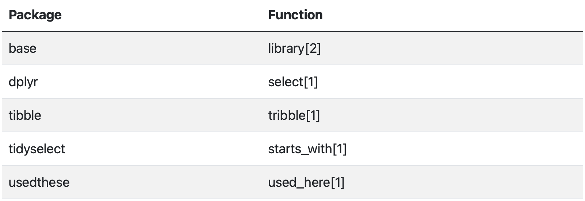

<!-- README.md is generated from README.Rmd. Please edit that file -->

```{r, include = FALSE}
knitr::opts_chunk$set(
  collapse = TRUE,
  comment = "#>",
  fig.path = "man/figures/README-",
  out.width = "100%"
)
```

# usedthese

<!-- badges: start -->

<!-- badges: end -->

The overall goal of usedthese is to:

1.  With `used_here()`, make it super easy to add a nicely-rendered summary table of R package & function usage, consistent with knitr's syntax highlighting, to the foot of a rendered Quarto or R Markdown document. [Development version available.]

2.  With `used_there()`, harvest multiple such tables to create an overall summary of usage for your website. [Statement of future intent.]

3.  With `used_elsewhere()`, websites deploying the usedthese package, and where the owners have explicitly chosen to add their website url to a participation list, may be analysed for a broader view of package & function usage. [Statement of future intent.]

4.  With `used_where()`, for a supplied specific function example use cases may be found from websites participating per 3. [Statement of future intent.]

## Installation

You can install the development version of usedthese from [GitHub](https://github.com/) with:

``` r
# install.packages("devtools")
devtools::install_github("cgoo4/usedthese")
```

## Example

This is a basic example showing how `used_here()` captures and counts the usage of the syntax-highlighted functions and their originating packages within a rendered Quarto document:

```{r example, eval=FALSE}
---
title: "example"
---
  
library(tidyverse)
library(usedthese)

tribble(~a1, ~a2, ~b1,
        1, 2, 3,
        4, 5, 6) |> 
  select(starts_with("a"))

used_here()
```


